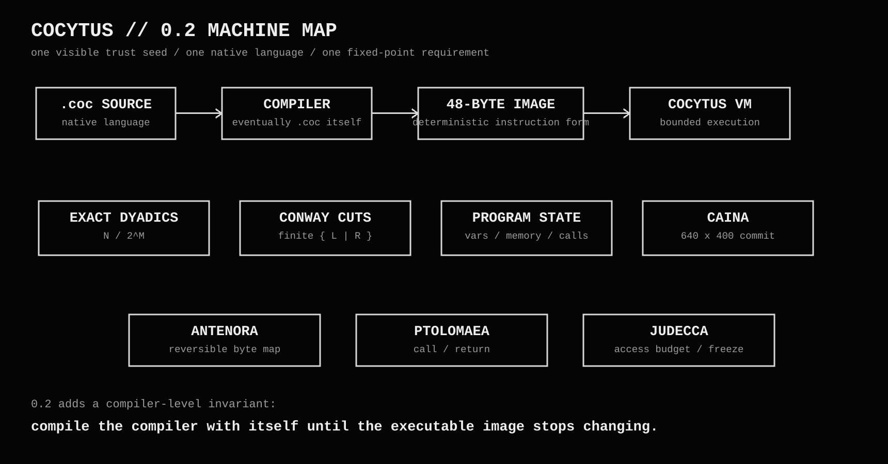
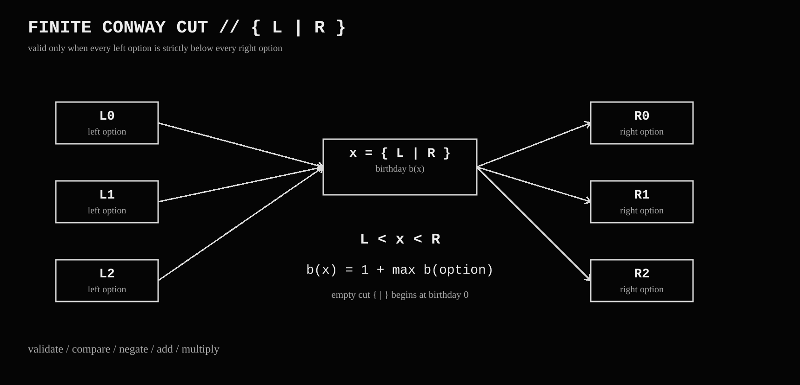
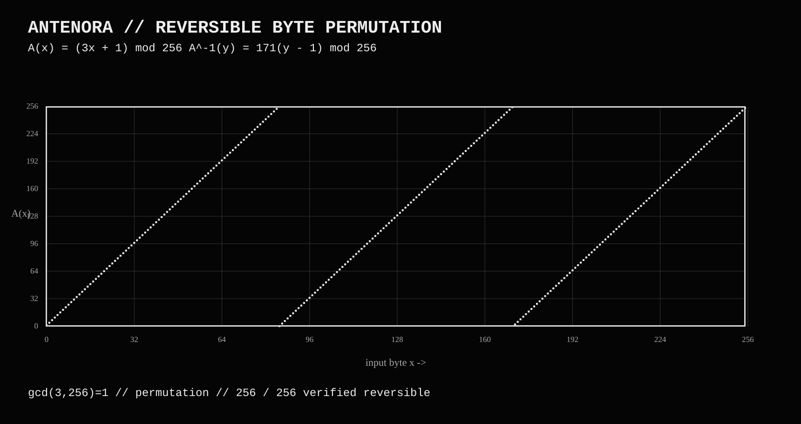
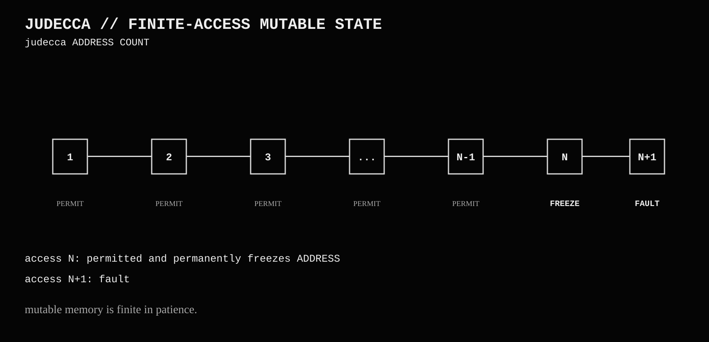
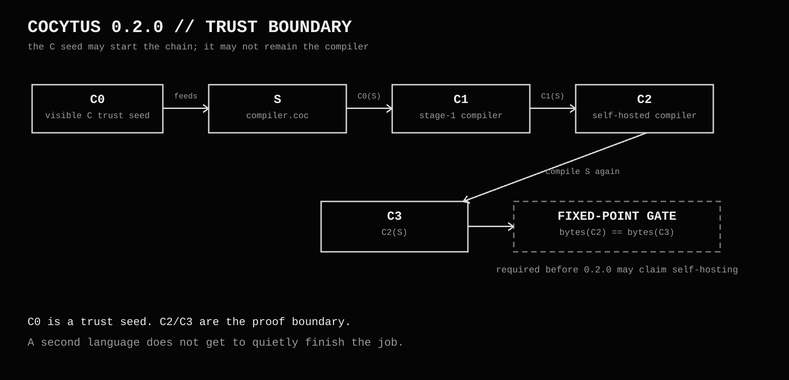
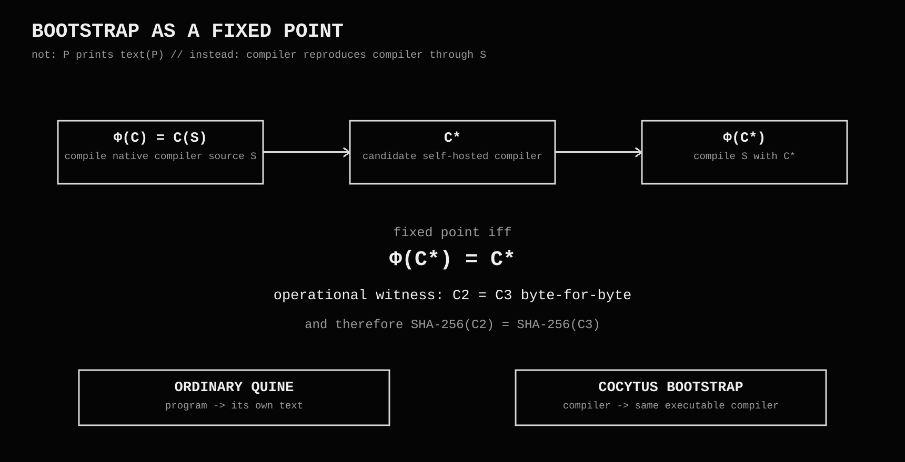
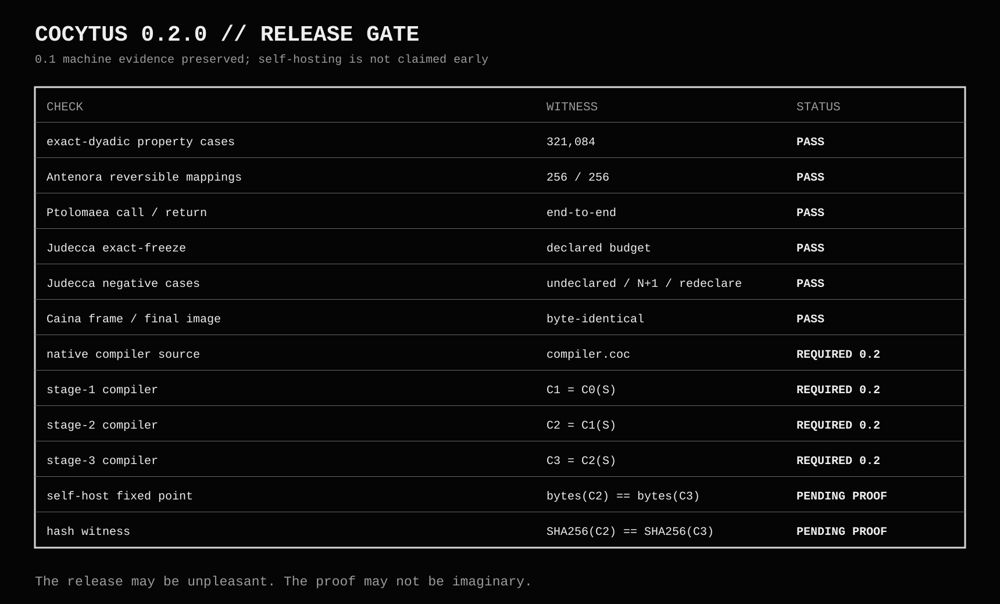

Cocytus

> **Ninth circle. Now executable.**

Cocytus is a deterministic esoteric programming language and virtual machine built around exact arithmetic, finite Conway surreal cuts, reversible byte transforms, bounded execution, deterministic visual state, and finite-access memory that eventually freezes.

Malbolge occupied Dante’s eighth circle.

There was still a ninth.

  

The machine

Cocytus source uses the .coc extension and compiles to fixed 48-byte instructions executed by a bounded deterministic VM.

Its ordinary numerical domain is exact finite dyadics:

[
x = \frac{N}{2^M}
]

with canonical normalization, so values such as

[
\frac{6}{2^3} = \frac{3}{2^2}
]

remain exact.

Arithmetic does not silently fall back to floating-point approximation. If a result falls outside the defined representable domain, it becomes unresolved.

Cocytus also contains a bounded implementation of finite, well-founded Conway cuts:

[
{L \mid R}
]

with validation, comparison, negation, addition, multiplication, and construction birthdays.

  

The four zones

Caina

Caina commits visual state.

The machine owns a deterministic 640×400 raster, with reproducible frame and final-image output.

Antenora

Antenora transforms each ordinary input byte by

[
A(x) = (3x + 1) \bmod 256
]

Since

[
\gcd(3,256)=1
]

the transformation is reversible:

[
A^{-1}(y)=171(y-1)\bmod 256
]

All 256/256 byte mappings are verified reversible.

  

Ptolomaea

Ptolomaea marks function entry and uses the machine’s real bounded call/return machinery.

Judecca

Judecca gives mutable memory a finite lifetime.

judecca ADDRESS COUNT

Accesses 1...N are permitted.

Access N freezes the address permanently.

Access N+1 faults.

Mutable memory is therefore not merely finite in size.

It is finite in patience.

  

0.2.0 — compiler fixed point

Cocytus 0.2 adds a stricter bootstrap requirement.

Let:

C0 = visible C trust seed
S  = native Cocytus compiler source

Then:

[
C_1=C_0(S)
]

[
C_2=C_1(S)
]

[
C_3=C_2(S)
]

The self-hosting gate is:

[
\operatorname{bytes}(C_2)=\operatorname{bytes}(C_3)
]

Equivalently, defining

[
\Phi(C)=C(S)
]

the compiler must reach a fixed point:

[
\Phi(C^)=C^
]

This is not a source-printing quine.

The requirement is that the compiler reproduce its own executable compiler image through its own language.

The C implementation remains visible as the stage-0 trust seed.

  

  

Current validation

321,084 exact-dyadic property cases          PASS
256 / 256 Antenora byte mappings             PASS
Ptolomaea call / return                      PASS
Judecca exact-freeze                         PASS
Judecca undeclared / overuse / redeclare     PASS as negative tests
Caina frame reproducibility                  PASS
Caina final-image reproducibility            PASS

The 0.2 self-hosting claim remains gated on real stage artifacts:

C1 = C0(S)                       REQUIRED
C2 = C1(S)                       REQUIRED
C3 = C2(S)                       REQUIRED
bytes(C2) == bytes(C3)           MUST PASS
SHA-256(C2) == SHA-256(C3)       MUST PASS

  

NFO

The complete old-school release note and machine description is here:

COCYTUS.NFO.md

License

Cocytus is intended for release under the Apache License 2.0.

This is not the public domain.

Even Hell has paperwork.

────────

Malbolge made the instruction stream betray the programmer.

Cocytus gives the programmer a finite number of chances before the machine freezes the evidence.

And in 0.2, the compiler has to prove that it can survive itself.
